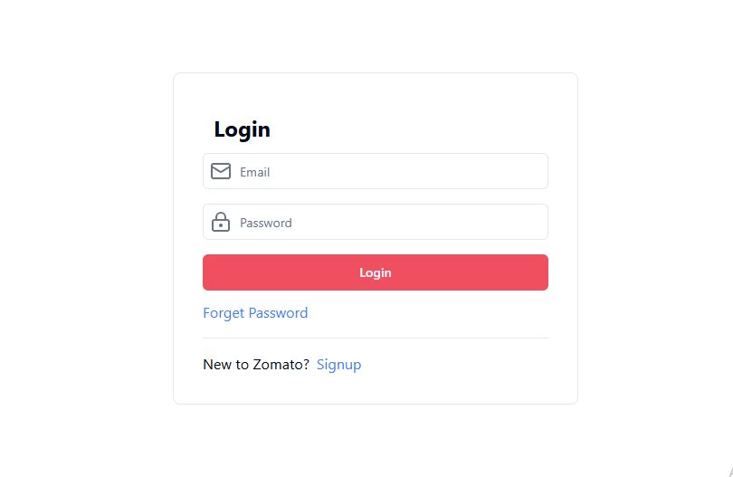
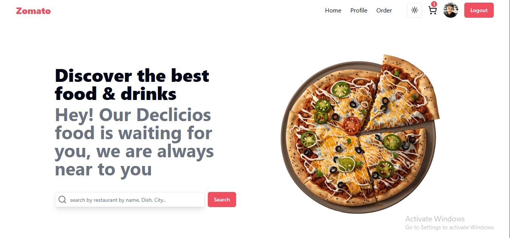
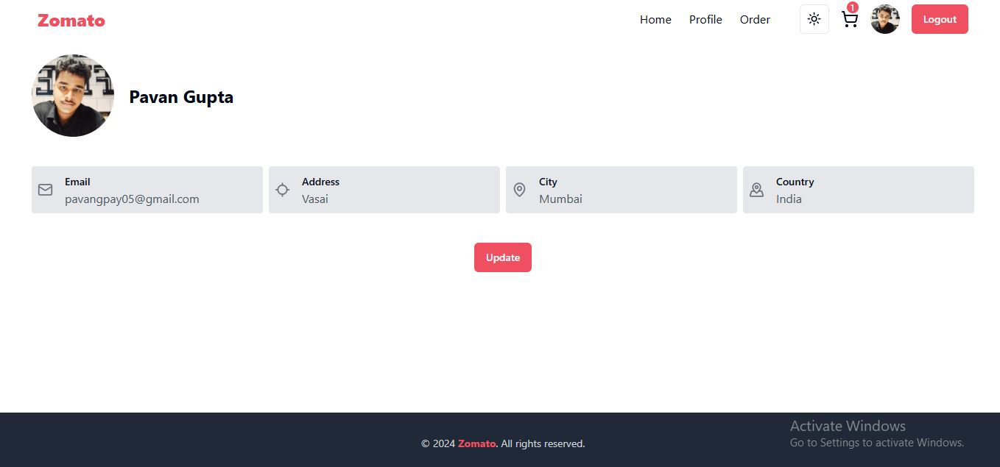
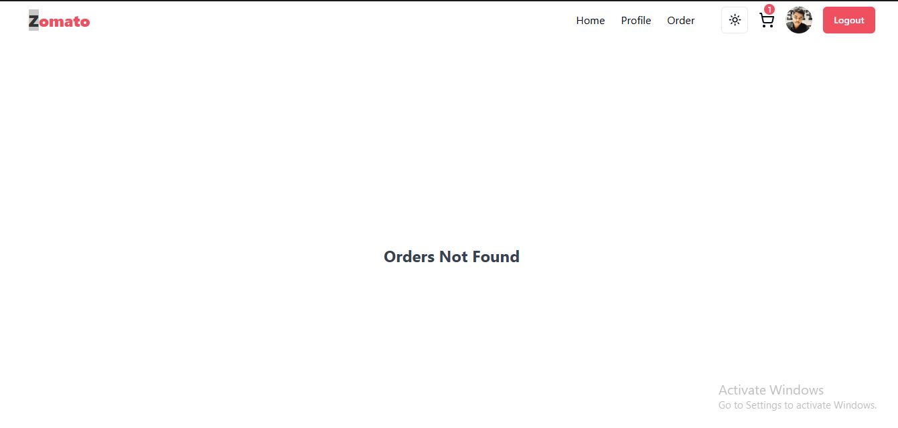
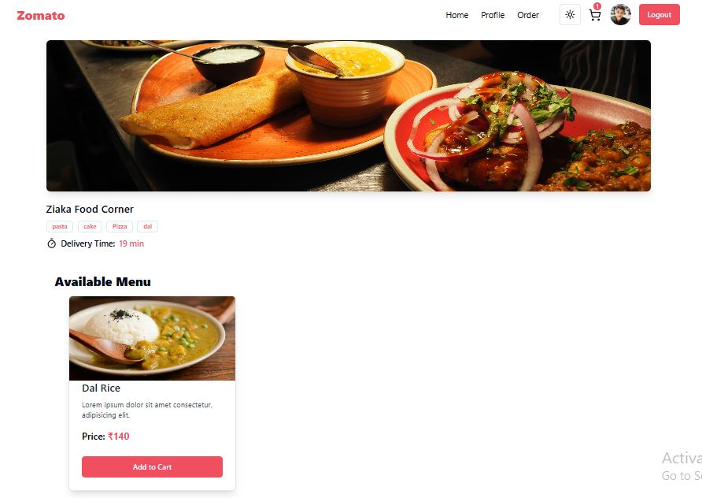
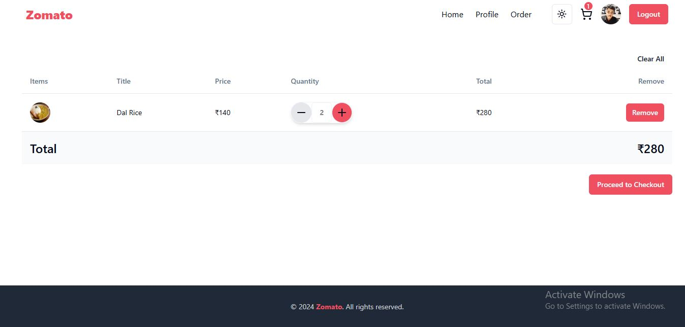
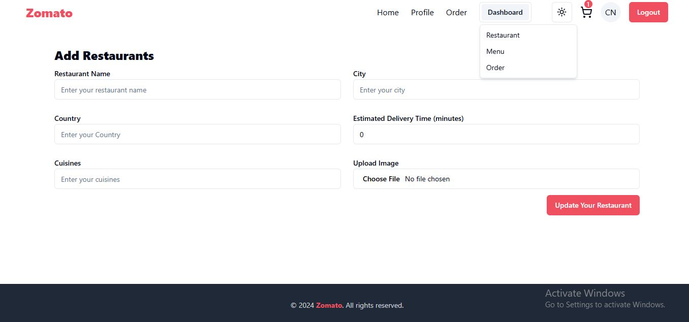
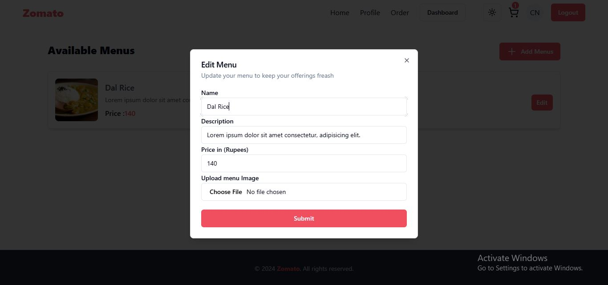

# Zomato Clone Web App

## Project Overview
This is a full-stack Zomato clone web application built using the MERN stack. It allows users to browse restaurant listings, order food, and process payments via a Stripe integration. The app also provides separate interfaces for customers, restaurant owners, and admins.

### Screenshots
### Screenshots

|  |  |
|----------------------------------------------------|--------------------------------------------------|
|  |  |
|    |  |
|  |  |

## Tech Stack
- **Frontend**: React.js, TypeScript, Zod
- **Backend**: Node.js, Express.js, Zod, Mongoose
- **Database**: MongoDB
- **State Management**: Redux

## Features
- **User Authentication**: Secure login and registration using JWT.
- **Restaurant Listings**: Search, filter, and sort restaurants based on various criteria.
- **Food Ordering**: Add menu items to the cart and proceed to checkout.
- **Payment Integration**: Stripe payment gateway integration for handling transactions.
- **Order Tracking**: Real-time updates for order status.

## System Architecture
- **Frontend**: React.js is used to handle user interactions with responsive and dynamic UI components. 
- **Backend**: Node.js with Express.js serves as the API server that connects with MongoDB to store data.
- **Database**: MongoDB stores the data for users, restaurants, orders, and payments.
- **Stripe Integration**: Stripe API is used for payment processing.

## Component Design
### User Authentication
- Login and registration functionality with password encryption and JWT-based authentication for security.

### Restaurant Listings
- Users can search, filter, and sort restaurants by various parameters like cuisine, location, and ratings.

### Food Ordering
- Menu display, add to cart, and complete the checkout process with a payment gateway integration.

### Payment Gateway Integration
- Secure Stripe integration to handle payments for the orders placed by the users.

## Data Models
### User Schema
- Stores user details such as name, email, hashed password, and authentication tokens.

### Restaurant Schema
- Details like name, location, menus, and ratings are captured for each restaurant.

### Order Schema
- Tracks order details like items ordered, user, restaurant, and delivery status.

### Payment Schema
- Manages payment details and transaction status for completed orders.

## Security Considerations
- **Data Encryption**: Sensitive information like passwords and payment data are encrypted.
- **Secure Authentication**: JWT tokens are used for user authentication and secure API access.
- **Role-Based Access Control**: Customers, restaurant owners, and admins have different access rights based on their roles.

## Performance & Scalability
- **Response Time**: Optimized API response time under 200ms.
- **Scalability**: The system is designed to scale horizontally to manage increased traffic and load.

## API Documentation
### User Routes
- `/api/v1/user/login`: Login user
- `/api/v1/user/register`: Register new user

### Restaurant Routes
- `/api/v1/restaurant/list`: Fetch all restaurants
- `/api/v1/restaurant/:id`: Get restaurant details

### Order Routes
- `/api/v1/order`: Get user orders
- `/api/v1/order/checkout`: Create checkout session

## Error Handling
- Centralized error handling middleware ensures that all errors are logged and managed properly across the entire application.

## Testing Strategy
- Unit testing for individual components and API endpoints using testing libraries like Jest and Mocha.

## Progress Status
- **Current Status**: In development phase
- **Work in Progress**: Order tracking and real-time updates.

## Future Enhancements
- **Real-time Notifications**: Push notifications for order status updates.
- **Advanced Search**: Enhance the search functionality to include location-based filtering.
